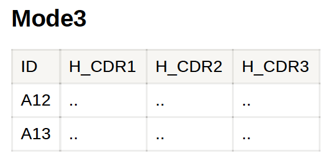

### Goal: Cluster sequences based on CDR1,CDR2,CDR3 next generation sequences data

#### 1. Web service

#### 2. Instruction (please upload and analysis data according to the following steps)

##### Step1. There are three Modes to choose depended on your input data.

##### Step2. Choose mode

**Mode1 : VH+VL(CDR confirmed)** Input with known CDR1, CD2, CD3 in VH
and VL region

**Mode2: VH+VL(CDR NOT confirmed)** Input with unknown CDR1, CD2, CD3 in
VH and VL region, returned output will find CDR1, CD2, CD3 sequence
automatically

**Mode3: VH (CDR confirmed)** This is for nanobody cluster, input with
known CDR1, CD2, CD3 in VH region

##### Step3. Modify the parameter of Identity, default is 0.7

 ##### Step4. Hit “Run
Ananlysis” Button

##### Step5. Wait for result and hit the “Download” button to get your result

#### 3. Output

**1. Return “Cluster\_Output.xlsx” file. **

**2. Return “cluster\_plot.pdf” file. **

